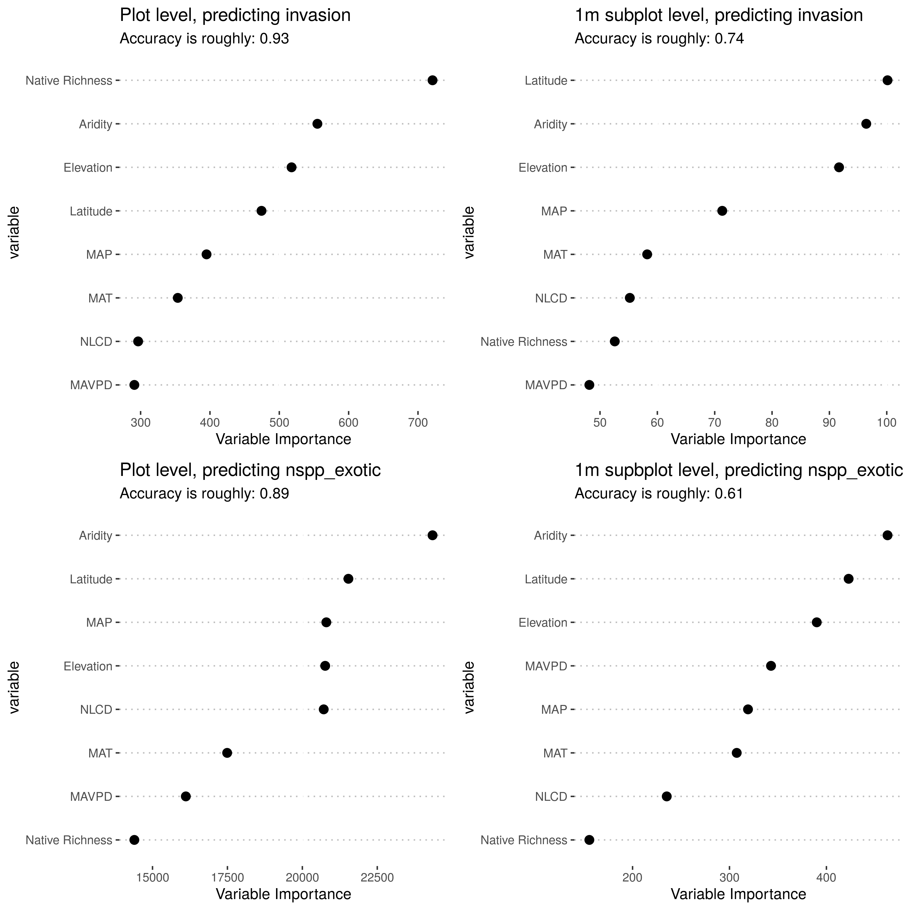

```{r setup, include=FALSE}
knitr::opts_chunk$set(echo = FALSE, message=F, warning=F)

library(tidyverse)
library(ggpubr)
```


```{r data_import}
# these are created in src/diversity_data_prep.R

plot_level <- readRDS("data/plot_level.RDS")
sp_level_1<-readRDS("data/sp_level_1.RDS")
site_level <- readRDS("data/site_level.RDS")

all_scales <- bind_rows(sp_level_1, site_level, plot_level)
```


# Exploratory plots: Effects of # exotic species

It seems like, instead of trying to figure out all of the unknowns, it might be better to just make the assumption that problematic exotic plants will not be unknown. So if we go with this assumption, the unknown plants will likely be a combination of mostly native plants, and not currently problematic exotics. Thus, most of the plots here are exotic vs notexotic.

Main takeaways so far:

- Messy relationships site to site, but zooming to the continental scale shows clear patterns
- Sometimes there are positive relationships between shannon diversity or number of species of exotics and not exotic, but the dominance (relative cover) almost always has negative relationship
- I did some random forest models, and **aridity**, elevation and latitude consistently came out as important variables. Pretty decent accuracy too. So another key result could be that increases in aridity due to climate change will lead to more widespread plant invasions.


## Species counts

First, species counts. So, we see again the same pattern (I am just including 1m, plot, and site-level scales). The main thing here that jumps out at me is the messiness we were talking about seems like it might turn out to be a pretty interesting result, and first plot, illustrating the point that at continental scales the broader exotic paradigm bears out, but then zooming in closer everything's super messy. 

```{r counts}

p_1<-ggplot(all_scales, aes(y = nspp_notexotic, x = nspp_exotic)) +
  geom_jitter(alpha = 0.05) +
  geom_smooth(method = "glm", method.args = list(family = "quasipoisson")) +
  facet_wrap(~scale, scales = "free")

p_2<-ggplot(all_scales %>% filter(scale != "site"), 
            aes(y = nspp_notexotic, x = nspp_exotic)) +
  geom_jitter(alpha = 0.05) +
  geom_smooth(#data = ,
              method = "glm",se=F, 
              method.args = list(family = "quasipoisson"), aes(color = site),
              show.legend = F, alpha=0.05) +
  scale_color_viridis_d()+
  facet_wrap(~scale, scales = "free")


ggarrange(p_1, p_2, nrow=2, widths = c(3,2))
```

We can also look at the effect of relative cover of exotics - same messy site-to-site effect, but then the general relationship is clear

```{r }

p_1<-ggplot(all_scales, aes(y = nspp_notexotic, x = rel_cover_exotic)) +
  geom_jitter(alpha = 0.05) +
  geom_smooth(method = "glm", method.args = list(family = "quasipoisson")) +
  facet_wrap(~scale, scales = "free")

p_2<-ggplot(all_scales %>% filter(scale != "site"), alpha = 0.05,
            aes(y = nspp_notexotic, x = rel_cover_exotic)) +
  # geom_jitter(alpha = 0.05) +
  geom_smooth(method = "glm",se=F, 
              method.args = list(family = "quasipoisson"), aes(color = site),
              show.legend = F) +
  scale_color_viridis_d()+
  facet_wrap(~scale, scales = "free")


ggarrange(p_1, p_2, nrow=2, widths = c(3,2))
```

## Alpha diversity

So now were getting into the alpha diversity, and from here I'll just show the broad relationships.

```{r diversity}

ggarrange(
ggplot(all_scales, aes(x = shannon_exotic, y = shannon_notexotic)) +
  geom_jitter(alpha = 0.1) +
  geom_smooth(method = "lm") +
  facet_wrap(~scale, scales = "free")
,
ggplot(all_scales, aes(x = rel_cover_exotic, y = shannon_notexotic)) +
  geom_jitter(alpha = 0.1) +
  geom_smooth(method = "lm") +
  facet_wrap(~scale, scales = "free"),
nrow=2
)

# ggplot(all_scales, aes(x = nspp_exotic, y = shannon_notexotic)) +
#   geom_jitter(alpha = 0.1) +
#   geom_smooth() +
#   facet_wrap(~scale, scales = "free")
```

## Random forest models with ancillary variables

So I guess here, we might be able to use aridity, elevation and latitude to model the NERRs, and maybe after removing the effects of covariates we'd get cleaner lines. That's the next thing I was thinking about getting to. I might use one of those global gridded soil datasets to add in a few general soil variables like percent sand. 



## Beta diversity

So I also have neondiveRsity creating beta diversity indexes now. 

```{r beta_diversity}
ggplot(all_scales %>% filter(scale != "1m"), aes(x = nspp_exotic, y = turnover)) +
  geom_jitter(alpha = 0.1) +
  geom_smooth() +
  facet_wrap(~scale, scales = "free")

ggplot(all_scales %>% filter(scale != "1m"), aes(x = nspp_exotic, y = nestedness)) +
  geom_jitter(alpha = 0.1) +
  geom_smooth() +
  facet_wrap(~scale, scales = "free")

ggplot(all_scales %>% filter(scale != "1m"), aes(x = rel_cover_exotic, y = nestedness)) +
  geom_jitter(alpha = 0.1) +
  geom_smooth() +
  facet_wrap(~scale, scales = "free")

ggplot(all_scales %>% filter(scale != "1m"), aes(x = rel_cover_exotic, y = turnover)) +
  geom_jitter(alpha = 0.1) +
  geom_smooth() +
  facet_wrap(~scale, scales = "free")

```

## family diversity

So now, we have neondiveRsity counting the number of families, and then also calculating shannon diversity using families instead of species. 

```{r fam_diversity}
ggplot(all_scales, aes(x = nspp_exotic, y = nfamilies)) +
  geom_jitter(alpha = 0.1) +
  geom_smooth(method = "glm", method.args = list(family="poisson")) +
  facet_wrap(~scale, scales = "free")
ggplot(all_scales, aes(x = rel_cover_exotic, y = nfamilies)) +
  geom_jitter(alpha = 0.1) +
  geom_smooth(method = "glm", method.args = list(family="poisson")) +
  facet_wrap(~scale, scales = "free")

ggplot(all_scales, aes(x = nspp_exotic, y = shannon_family)) +
  geom_jitter(alpha = 0.1) +
  geom_smooth(method = "lm") +
  facet_wrap(~scale, scales = "free")
ggplot(all_scales, aes(x = rel_cover_exotic, y = shannon_family)) +
  geom_jitter(alpha = 0.1) +
  geom_smooth() +
  facet_wrap(~scale, scales = "free")

```


